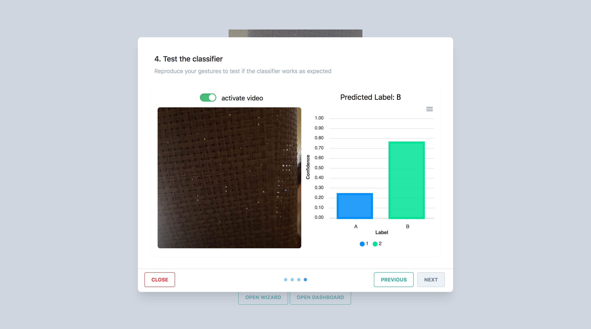
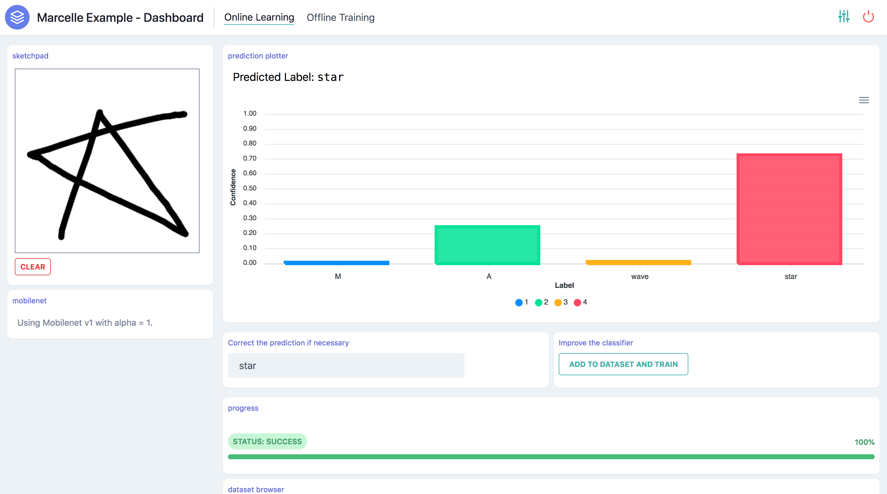

# Examples

A few examples are available on [Glitch.com](https://glitch.com/@marcelle.crew/marcelle-examples). More advanced examples using Rollup, Webpack, or with custom modules are available with the source code on [Github](https://github.com/marcellejs/marcelle).

## Basic dashboard

A project implementing a simple image classifier using Mobilenet embeddings for feature extraction and a Multilayer perceptron for classification. The application allows you to record examples, train the model and test its performance, and play with real-time image classification.

[Edit on Glitch](https://glitch.com/~marcelle-v2-dashboard)

## Model comparison

An extension of the previous example featuring a dashboard dedicated to model comparison. The application allows to train and evaluate two models in parallel: a MLP and a KNN.

[Edit on Glitch](https://glitch.com/~marcelle-v2-mlp-vs-knn)

## Wizard

With an image recognition scenario similar to [the first example](#basic-dashboard), except that instead of a dashboard, the application features a step-by-step guide using a Wizard.

[Edit on Glitch](https://glitch.com/~marcelle-v2-wizard)

## Sketching

An incremental learning example where users can build a sketch recognizer from their own drawings. This example illustrates how to program alternative workflows.

[Edit on Glitch](https://glitch.com/~marcelle-v2-sketch)

## Model Testing

A prototype dedicated to the interactive testing of a pre-trained model (in this case Mobilenet). The dashboard allows the user to upload images and inspect the associated predictions.

[Edit on Glitch](https://glitch.com/~marcelle-v2-testing)
