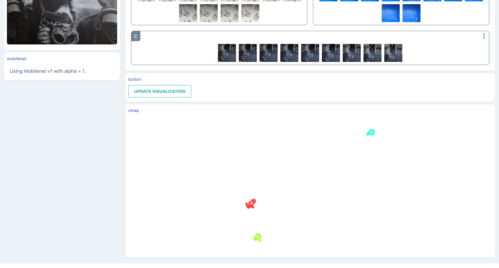
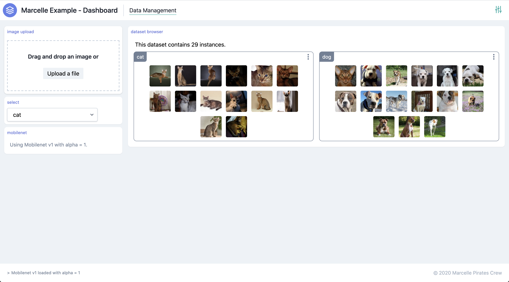
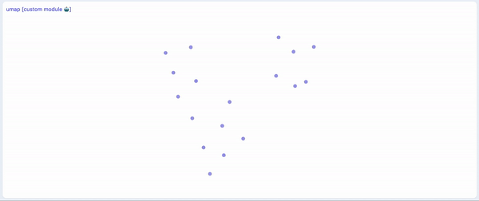

# Creating Modules

Marcelle can be easily extended using custom modules, that can be created locally in an application.

In this tutorial, we will create a custom module for the visualization of datasets using Uniform Manifold Approximation and Projection (UMAP). UMAP is a dimension reduction technique that can be used for visualisation similarly to t-SNE, but also for general non-linear dimension reduction.

Here is what the final application looks like (try it on [demos.marcelle.dev](https://demos.marcelle.dev/umap/)):



The details for the underlying mathematics can be found in the [following paper on ArXiv](https://arxiv.org/abs/1802.03426):

> McInnes, L, Healy, J, _UMAP: Uniform Manifold Approximation and Projection for Dimension Reduction_, ArXiv e-prints 1802.03426, 2018

## Generating the application

> Note: if you already have an application generated with the CLI which contains at least one dataset, you can skip this step.

Let's start by generating a new Marcelle application using the CLI:

```bash
mkdir marcelle-umap
cd marcelle-umap
marcelle generate app
```

Select the default options of the CLI. Then, make sure the application works by running the development server:

```bash
npm run dev
```

And open [http://localhost:8080](http://localhost:8080) in your browser.

Then, update the main application entry point (`src/index.js`) with the application skeleton:

::: details src/index.js

```js
import '@marcellejs/core/dist/bundle.css';
import {
  browser,
  webcam,
  mobilenet,
  dataset,
  button,
  dataStore,
  dashboard,
  textfield,
} from '@marcellejs/core';

// -----------------------------------------------------------
// INPUT PIPELINE & DATA CAPTURE
// -----------------------------------------------------------

const input = webcam();
const featureExtractor = mobilenet();

const label = textfield();
label.name = 'Instance label';
const capture = button({ text: 'Hold to record instances' });
capture.name = 'Capture instances to the training set';

const instances = input.$images
  .filter(() => capture.$down.value)
  .map(async (img) => ({
    type: 'image',
    data: img,
    label: label.$text.value,
    thumbnail: input.$thumbnails.value,
    features: await featureExtractor.process(img),
  }))
  .awaitPromises();

const store = dataStore({ location: 'localStorage' });
const trainingSet = dataset({ name: 'TrainingSet', dataStore: store });
trainingSet.capture(instances);

const trainingSetBrowser = browser(trainingSet);

// -----------------------------------------------------------
// DASHBOARDS
// -----------------------------------------------------------

const dash = dashboard({
  title: 'Marcelle Example - Dashboard',
  author: 'Marcelle Pirates Crew',
});

dash
  .page('Data Management')
  .useLeft(input, featureExtractor)
  .use([label, capture], trainingSetBrowser);
dash.settings.use(trainingSet);

dash.start();
```

:::

The application's input is a webcam, which images are preprocessed using the pretrained neural network Mobilenet. Training data can be captured to a dataset called `TrainingSet`.

You should obtain the following application:



## Generating a Module

Modules are essentially JavaScript objects exposing a set of streams for communicating with other Marcelle modules, and optionally providing a view. The easiest way to generate a new module is using the CLI:

```bash
marcelle generate module
```

Choosing the name `umap`, the CLI will generate the following files:


- `src/modules/umap/umap.module.js` contains the main module class definition
- `src/modules/umap/umap.svelte` is a [Svelte](https://svelte.dev/) component defining our module's view
- `src/modules/umap/index.js` is used to export a constructor function for the module

The generated module is already functional. Let's start by displaying it in our application. Edit `src/index.js` to import the module, create a new instance, and display it in the dashboard:

```js{5,11,18}
import '@marcellejs/core/dist/bundle.css';
import {
  ...
} from '@marcellejs/core';
import { umap } from './modules';

// ...

const trainingSetBrowser = browser(trainingSet);

const trainingSetUmap = umap();

// ...

dash
  .page('Data Management')
  .useLeft(input, featureExtractor)
  .use([label, capture], trainingSetBrowser, trainingSetUmap);
dash.settings.use(trainingSet);

dash.start();
```

You should see the custom module appear in the dashboard:

<div style="background: rgb(237, 242, 247); padding: 8px; margin-top: 1rem;">
  
</div>

## Connecting to the dataset

Connect to the (quite undocumented, see [here](https://docs.feathersjs.com/api/services.html#service-methods)) data store service storing instances:

```js{2,6,9-13}
export class Umap extends Module {
  constructor(dataset) {
    super();
    this.name = 'umap [custom module 🤖]';
    this.description = 'TODO: Umap description';
    this.dataset = dataset;
  }

  async update() {
    const instances = await this.dataset.instanceService.find({
      query: { $select: ['features', 'label'] },
    });
    console.log('instances', instances);
  }
}
```

Let's add a button to our dashboard to trigger an update of our module. When implementing UMAP, this will allow us to trigger the computation of UMAP. We start by passing our `trainingSet` to `umap`. Then, we create a new button module, which triggers an update when clicked. Finally, we add the button to the dashboard.

```js{3-6,13}
const trainingSetUmap = umap(trainingSet);

const updateUMap = button({ text: 'Update Visualization' });
updateUMap.$click.subscribe(() => {
  trainingSetUmap.update();
});

// ...

dash
  .page('Data Management')
  .useLeft(input, featureExtractor)
  .use([label, capture], trainingSetBrowser, updateUMap, trainingSetUmap);
```

When clicking the 'Update Visualization' button, the following message should appear in the console:

`instances > Object { total: 12, limit: 100, skip: 0, data: (12) […] }`

Each instance in the `data` array should be an object with properties `features` and `label`.

## Computing UMAP

We will use the [umap-js](https://github.com/PAIR-code/umap-js) library from the Google PAIR team. First, let's install the library:

```bash
npm install umap-js
```

We can then import the library and compute UMAP asynchronously, following the library's [documentation](https://github.com/PAIR-code/umap-js#asynchronous-fitting). We use the `fitAsync` method, that takes as input a 2D data array. We can convert the instances fetched from the dataset as such an array, by concatenating all feature vectors.

```js{2,12-18}
import { Module } from '@marcellejs/core';
import UMAP from 'umap-js';
import Component from './umap.svelte';

export class Umap extends Module {
  // ...

  async update() {
    const instances = await this.dataset.instanceService.find({
      query: { $select: ['features', 'label'] },
    });
    // Concatenate all instance features in a 2D array:
    const umapData = instances.data.reduce((data, { features }) => data.concat(features), []);
    const umap = new UMAP.UMAP();
    const embedding = await umap.fitAsync(umapData, (epochNumber) => {
      console.log('Epoch', epochNumber, umap.getEmbedding());
    });
    console.log('Final embedding', embedding);
  }

  //...
}
```

The application should now log the UMAP fitting process in the console when clicking on the 'update visualization' button.

> ⚠️ Note that you will need at least 15 instances in the training set for the algorithm to work (check the console for errors)

## Exposing the results as a stream

For now, the results of the UMAP computation are limited to our module. In Marcelle, we use reactive streams to expose data to the outside world. Modules can expose streams that can be used by other modules in a pipeline. We will create a stream called `$embedding` that produce events along the fitting process. Such a stream could be used by other modules for further processing, but it will also help updating the visualization in the module's view in real-time.

First, we initialize the stream in the constructor, and call the module's `start()` method to start stream processing. Then, we will imperatively push values into the stream at each iteration of the UMAP fitting process.

```js{1,11-12,22-25}
import { Module, Stream } from '@marcellejs/core';
import UMAP from 'umap-js';
import Component from './umap.svelte';

export class Umap extends Module {
  constructor(dataset) {
    super();
    this.name = 'umap [custom module 🤖]';
    this.description = 'TODO: Umap description';
    this.dataset = dataset;
    this.$embedding = new Stream([], true);
    this.start();
  }

  async update() {
    const instances = await this.dataset.instanceService.find({
      query: { $select: ['features', 'label'] },
    });
    // Concatenate all instance features in a 2D array:
    const umapData = instances.data.reduce((data, { features }) => data.concat(features), []);
    const umap = new UMAP.UMAP();
    const embedding = await umap.fitAsync(umapData, () => {
      this.$embedding.set(umap.getEmbedding());
    });
    this.$embedding.set(embedding);
  }

  // ...
}
```

To check if the stream works, we can monitor it in the main script `src/index.js`, by logging its event to the console:

```js
trainingSetUmap.$embedding.subscribe(console.log);
```

## Visualizing the embedding

We are now ready to visualize the resulting embedding using a scatterplot. The view will be created using [Svelte](https://svelte.dev/), a compile-time frontend framework that plays well with reactive programming. We will use the [scatter-gl](https://github.com/PAIR-code/scatter-gl/) library from the Google PAIR team, that provides webgl-accelerated scatterplot renderring.

Let's edit `umap.svelte` to pass our stream of embeddings to the component:

```html{5,13}
<script>
  import { ModuleBase } from '@marcellejs/core';

  export let title;
  export let embedding;
</script>

<style></style>

<svelte:options accessors />

<ModuleBase {title}>
  <div>{$embedding}</div>
</ModuleBase>
```

`export let embedding;` defines a 'prop', that will be accessible when the component instanciation. `{$embedding}` means that we consider that `embedding` is a data stream (a 'store' in svelte's terminology), and that the DOM will be updated reactively.

Let's correct our view's instanciation in the module definition (`umap.module.js`), to pass our stream `this.$embedding` to the component's `embedding` prop:

```js{12}
export class Umap extends Module {
  // ...

  mount(targetSelector) {
    const target = document.querySelector(targetSelector || `#${this.id}`);
    if (!target) return;
    this.destroy();
    this.$$.app = new Component({
      target,
      props: {
        title: this.name,
        embedding: this.$embedding,
      },
    });
  }
}
```

When trying the application again, the view should display the list of generated values reactively. Let's replace it with a scatterplot visualization.

First, we need to install the scatter-gl library:

```bash
npm install scatter-gl
```

We then integrate scatter-gl in the Svelte component:

```html
<script>
  import s from 'scatter-gl';
  import { onMount } from 'svelte';
  import { ModuleBase } from '@marcellejs/core';

  const { ScatterGL } = s;

  export let title;
  export let embedding;

  let scatterContainer;
  let scatterGL;
  onMount(() => {
    scatterGL = new ScatterGL(scatterContainer, {
      styles: {
        point: { scaleDefault: 1.6, scaleSelected: 2, scaleHover: 2 },
      },
    });

    embedding.subscribe((points) => {
      if (points.length > 0) {
        const dataset = new ScatterGL.Dataset(points);
        scatterGL.render(dataset);
      }
    });
  });
</script>

<style>
  #scatter-container {
    height: 400px;
  }
</style>

<ModuleBase {title}>
  <div id="scatter-container" bind:this="{scatterContainer}" />
</ModuleBase>
```

This code requires basic svelte knowledge. The main elements are:

- We include in the view a `div` to receive the scatterplot that we bind to a variable `scatterContainer`. This means that once the component is mounted in the DOM, the `scatterContainer` variable will be filled with the corresponding element.
- The `onMount` function schedules a callback to run as soon as the component has been mounted to the DOM. Here, we do two things:

  1. We initialize `ScatterGL` with our `scatterContainer` element
  2. We subscribe to the embedding stream, in order to re-render the scatterplot at each new event.

We obtain the following visualization:



## Further Improvements

We can further improve the component, for instance by using the instances' labels to define the point colors in the scatterplot. The main steps to add this feature are:

1. Create a `$labels` stream which events are an array of the labels of each instance in the training set
2. Pass the stream as a prop to the svelte component
3. In the component's `onMount` function, subscribe to the labels stream to define the point colors, using ScatterGL's `setPointColorer` method.

::: details See Solution

`umap.module.js`:

```js{12,22-23,40}
import { Module, Stream } from '@marcellejs/core';
import UMAP from 'umap-js';
import Component from './umap.svelte';

export class Umap extends Module {
  constructor(dataset) {
    super();
    this.name = 'umap [custom module 🤖]';
    this.description = 'TODO: Umap description';
    this.dataset = dataset;
    this.$embedding = new Stream([], true);
    this.$labels = new Stream([], true);
    this.start();
  }

  async update() {
    const instances = await this.dataset.instanceService.find({
      query: { $select: ['features', 'label'] },
    });
    // Concatenate all instance features in a 2D array:
    const umapData = instances.data.reduce((data, { features }) => data.concat(features), []);
    const labels = instances.data.map((x) => x.label);
    this.$labels.set(labels);
    const umap = new UMAP.UMAP();
    const embedding = await umap.fitAsync(umapData, () => {
      this.$embedding.set(umap.getEmbedding());
    });
    this.$embedding.set(embedding);
  }

  mount(targetSelector) {
    const target = document.querySelector(targetSelector || `#${this.id}`);
    if (!target) return;
    this.destroy();
    this.$$.app = new Component({
      target,
      props: {
        title: this.name,
        embedding: this.$embedding,
        labels: this.$labels,
      },
    });
  }
}
```

`umap.svelte`:

```html{10,20-29}
<script>
  import s from 'scatter-gl';
  import { onMount } from 'svelte';
  import { ModuleBase } from '@marcellejs/core';

  const { ScatterGL } = s;

  export let title;
  export let embedding;
  export let labels;

  let scatterContainer;
  let scatterGL;
  onMount(() => {
    scatterGL = new ScatterGL(scatterContainer, {
      styles: {
        point: { scaleDefault: 1.6, scaleSelected: 2, scaleHover: 2 },
      },
    });
    labels.subscribe((labs) => {
      const classIndices = Array.from(new Set(labs));
      const hues = [...new Array(classIndices.length)].map((_, i) =>
        Math.floor((255 / classIndices.length) * i),
      );
      const heavyTransparentColorsByLabel = hues.map((hue) => `hsla(${hue}, 100%, 50%, 0.75)`);
      scatterGL.setPointColorer((index, selectedIndices, hoverIndex) => {
        return heavyTransparentColorsByLabel[classIndices.indexOf(labs[index])];
      });
    });
    embedding.subscribe((points) => {
      if (points.length > 0) {
        const dataset = new ScatterGL.Dataset(points);
        scatterGL.render(dataset);
      }
    });
  });
</script>

<style>
  #scatter-container {
    height: 400px;
  }
</style>

<svelte:options accessors />

<ModuleBase {title}>
  <div id="scatter-container" bind:this="{scatterContainer}" />
</ModuleBase>
```

:::


## Final Result

The source code for the example is available [on Github](https://github.com/marcellejs/demos/tree/main/umap), and the demo is [available online](https://demos.marcelle.dev/umap/).
