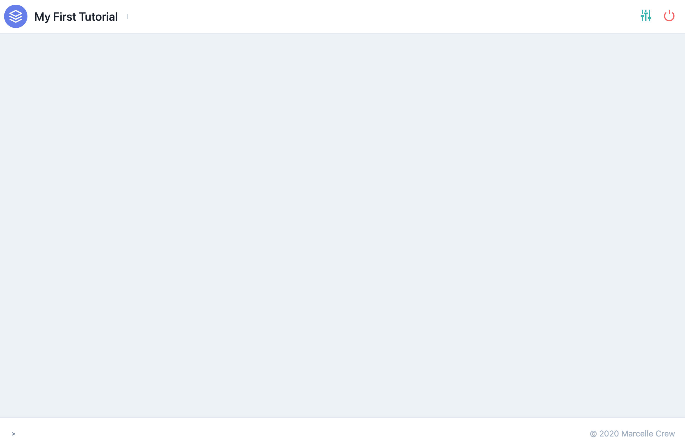
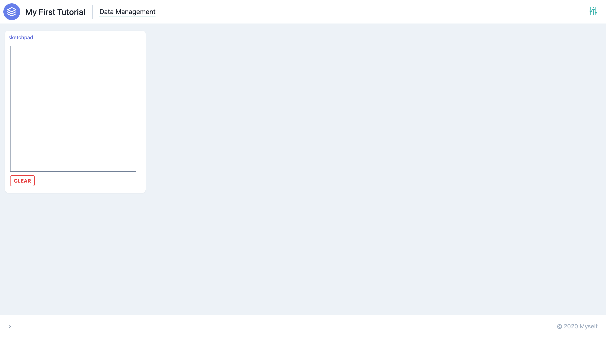

# Getting started

In this tutorial, you will learn how to build a simple Marcelle application that allows the user to train a classifier to recognize drawings.

## Setting up

The best way to set up your application is by using the dedicated [Marcelle CLI tools](https://github.com/marcellejs/cli)). The CLI is an npm package that must be installed globally:

```bash
npm install -g @marcellejs/cli
```

Once installed, the `marcelle` command should be available:

```bash
marcelle --version
```

Then, create a folder for the app and generate an application with the CLI:

```bash
mkdir marcelle-tutorial
cd marcelle-tutorial
marcelle generate app
```

Several options are available to customize the project. If you don't know what to choose, just hit enter to select the defaults.


This will scaffold a new Marcelle project with the following structure (it might vary according to the build tool, this example is for vite):

```bash
.
├── README.md
├── index.html     # The main HTML page for your application
├── package.json
├── src
│   ├── index.js   # Main application script
│   └── components    # Directory containing local components bundled with your application
│       └── index.js
└── vite.config.js # Build tool configuration file
```

::: tip Alternative
It is also possible (and easy) to get started without any install!

Just go to [https://glitch.com/edit/#!/marcelle-v2-blank](https://glitch.com/edit/#!/marcelle-v2-blank)
and click on "Remix to Edit" in the top right, then start editing the script.
:::

## App basics

Marcelle is a client-side JavaScript framework. All Marcelle applications run in the browser without the need for communication with a Web server. In its simplest form, a Marcelle application is a webpage defined by `index.html` and a script file `src/index.ts` (or `src/index.js` if you chose JavaScript as language when generating your app).

To see the application running, type the command:

```bash
npm run dev
```

Your app should be running at `http://localhost:3000/` (port may vary). If everything went well you should have a dashboard with a single text module.

Let's now inspect what's your app is made of. Open the file `src/script.js` (or `src/script.ts`), that contains the most minimal skeleton of a marcelle application. Let's start from scratch!
Replace the contents of the file by the following two lines, that import the marcelle library:

```js
import '@marcellejs/core/dist/marcelle.css';
import * as marcelle from '@marcellejs/core';
```

## Setting up a sketchpad

In our app, we want to capture drawings in order to interactively build a classifier. Drawings will be captured as images from a sketchpad. Marcelle is built around _components_, that can be instanciated using construction functions. To create a new [sketchPad module](../components/data-sources.html#sketchpad), add the following line to the script:

```js
const input = marcelle.sketchPad();
```

Note that if you look at the app in your browser, you will still see a blank page. In fact, Marcelle allows you to build you ML pipelines and choose which elements to display on an interface.

## Showing the interface

Two types of interface composition mechanisms (or layouts) are currently available: [Dashboards](../api/dashboard.html) or Wizard [Wizards](../api/wizard.html). In this tutorial we will create a dashboard where we will add elements from the pipeline that we would like to display. To create a dashboard, the API provides a `dashboard()` function:

```js
const myDashboard = marcelle.dashboard({
  title: 'My First Tutorial',
  author: 'Myself',
});
```

Then to visualise the created dashboard, we need to `start` it:

```js
myDashboard.show();
```

Now, you should see an empty dashboard in the browser.



To display a module on the dashboard, we first create a page (see the [dashboard API](../api/dashboard.html) for more details) and specify all the components displayed on this dashboard page with the `.sidebar()` and `.use()` functions. `.sidebar()` adds components on the left column of the dashboard while the `.use()` function adds components on the main central column. In this tutorial we will add a sketchpad on the left of a dashboard page called "Data Management". Above the `dashboard.show();` statement:

```js{6}
const myDashboard = marcelle.dashboard({
  title: 'My First Tutorial',
  author: 'Myself',
});

myDashboard.page('Data Management').sidebar(input);

myDashboard.show();
```

Which should look like this:



## Building the ML pipeline

### Feature extraction and dataset creation

If we want to build a classifier that takes images as inputs and that can be trained efficiently with few samples, we usually don't use the raw image data. We need to extract features that are well suited for the task. To do so, we could use a pre-trained model called `Mobilenet` that takes an image as input (whose size is 224 x 224 x 3 so 150528 dimensions) and outputs a vector of lower dimension. To declare a mobilenet feature extractor in Marcelle, we do:

```js
const featureExtractor = marcelle.mobileNet();
```

Marcelle heavily relies on a paradigm called reactive programming. Reactive programming means programming with asynchronous data streams, i.e. sequences of ongoing events ordered in time. Most Marcelle components expose data streams that can be filtered, transformed, and consumed by other components.

For example, the `sketchpad` module exposes a stream called `$images`, that emits events containing an image of the sketchpad content every time a stroke is drawn on the sketchpad. To react to these events, we can subscribe to the stream, for instance to log its events to the console:

```js
input.$images.subscribe((img) => {
  console.log(img);
});
```

If you open your browser's developer tools, you should see messages printed every time you finish a stroke.

And if we want to compute the features associated to each new image from the sketchpad input, we write a function that subscribes to the `images` stream and processes the data:

```js
input.$images.subscribe(async (img) => {
  const features = await featureExtractor.process(img);
  console.log(features);
});
```

We now create a derived stream of instances from the sketchpad stream like this:

```js
const $instances = input.$images
  .map(async (img) => ({
    x: await featureExtractor.process(img),
    y: 'test',
    thumbnail: input.$thumbnails.value,
  }))
  .awaitPromises();
```

Instances have few properties. In this example, we see that the label is specified by a string that we 'hard-coded' to `test`. In an application, a label can be provided by the user through a [textfield](../api/components/widgets.html#textfield) on the interface:

```js
const label = marcelle.textField();
label.title = 'Instance label';
```

Let's add the text field to the dashboard page using the dashboard's `.use()` method:

```js
myDashboard.page('Data Management').sidebar(input, featureExtractor).use(label);
```

The textfield module exposes a `$text` stream that emits values whenever the user input changes. Let's log it to the console:

```js
label.$text.subscribe((currentInput) => {
  console.log('currentInput:', currentInput);
});
```

We can access the current value of a stream using its `.value` property. We use it to complement our stream of instances:

```js{4}
const $instances = input.$images
  .map(async (img) => ({
    x: await featureExtractor.process(img),
    y: label.$text.value,
    thumbnail: input.$thumbnails.value,
  }))
  .awaitPromises();
```

We now create a dataset that can be used to train a classifier. A dataset requires a [DataStore](../api/data-storage.html#datastore) to store the captured data. A datastore can be created in the `localStorage` of your browser, but also on a server using a specified database.

Once the datastore has been instanciated, we declare a marcelle [dataset](../api/data-storage.html#dataset) with a given name and a given datastore. The dataset has a `capture` method to store an incoming stream of instances. In Marcelle, these three steps can be done as such:

```js
const store = marcelle.dataStore('localStorage');
const trainingSet = marcelle.dataset('TrainingSet', store);

$instances.subscribe(trainingSet.create.bind(trainingSet));
```

To visualize our training dataset, we can use a module called [datasetBrowser](../api/components/data-displays.html#datasetbrowser) that provides an interface to visualize the dataset content.

```js
const trainingSetBrowser = marcelle.datasetBrowser(trainingSet);

// ...

myDashboard.page('Data Management').sidebar(input, featureExtractor).use(label, trainingSetBrowser);
```

If you draw on the sketchpad, you will notice that an instance is recorded at every stroke, because the dataset is capturing all instances coming from the sketchpad. To give the user more control over what is captured as training data, we can create a [button](../api/components/widgets.html#button) to capture particular drawings.

```js
const capture = marcelle.button({ text: 'Click to record an instance' });
capture.title = 'Capture instances to the training set';

// ...

myDashboard
  .page('Data Management')
  .sidebar(input, featureExtractor)
  .use([label, capture], trainingSetBrowser);
```

Using reactive programming, we can filter, transform and combine streams. In this case, we want to sample instances whenever the button is clicked. To do this, we can use the `sample` method from the button's `$click` stream:

```js
const $instances = capture.$click
  .sample(input.$images)
  .map(async (img) => ({
    x: await featureExtractor.process(img),
    y: label.$text.value,
    thumbnail: input.$thumbnails.value,
  }))
  .awaitPromises();
```

If you refresh the page in the browser, you should have:


### Training a classifier

Next, we have to declare a classifier that will learn to recognize drawings from the training dataset. In this tutorial we use a Multilayer Perceptron (MLP), that can be declared by:

```js
const classifier = marcelle.mlpClassifier({ layers: [32, 32], epochs: 20 });
```

To start training, a button is added on the interface:

```js{8}
const trainingButton = marcelle.button({ text: 'Train' });

// ...

myDashboard
  .page('Data Management')
  .sidebar(input, featureExtractor)
  .use([label, capture], trainingSetBrowser, trainingButton);
```

Then, we attach the training method of the MLP classifier to the stream of clicks. This way, each time an event is triggered through a click, the classifier will be trained on the `trainingSet`:

```js
trainingButton.$click.subscribe(() => {
  classifier.train(trainingSet);
});
```

When training Deep Neural Networks, it is usually important to monitor the training, which typically means to inspect the losses and the accuracies. In Marcelle, the `trainingPlot` module can be used to do so and then added to the dashboard.

```js{9}
const plotTraining = marcelle.trainingPlot(classifier);

// ...

myDashboard
  .page('Data Management')
  .sidebar(input, featureExtractor)
  .use([label, capture], trainingSetBrowser, trainingButton)
  .use(plotTraining);
```

Thus, after adding instances to the dataset, launching training is visualised as follows:


## Making Predictions

Now that our model is trained, we can create another pipeline for prediction. With the same input sketchpad, we will make a prediction at every new drawing, using the trained model.

To create a stream of predictions, we need to pass images through the feature extractor (mobilenet), and then through the `.predict()` method of our classifier. To do this, we use the `.map()` method of streams, that transforms a stream by applying a function to each of its elements:

```js
const $predictions = input.$images
  .map(async (img) => {
    const features = await featureExtractor.process(img);
    return classifier.predict(features);
  })
  .awaitPromises();

$predictions.subscribe(console.log);
```

Note that in Marcelle, prediction functions are asynchronous. This means that they return promises. In order to create a stream containing the resulting values, we need to call `awaitPromises()` on the resulting stream.

To visualize the predictions, we can use a module called `classificationPlot`. Let's add the sketchpad and this visualization module to a new page so that we can test our classifier:

```js
const predViz = marcelle.confidencePlot($predictions);

myDashboard.page('Direct Evaluation').sidebar(input).use(predViz);
```

To give it a try, first train the model, then switch to the second page for testing!


::: details Full Code

```js
import '@marcellejs/core/dist/marcelle.css';
import * as marcelle from '@marcellejs/core';

const input = marcelle.sketchPad();
const featureExtractor = marcelle.mobileNet();

const label = marcelle.textField();
label.title = 'Instance label';

const capture = marcelle.button({ text: 'Click to record an instance' });
capture.title = 'Capture instances to the training set';

const $instances = capture.$click
  .sample(input.$images)
  .map(async (img) => ({
    x: await featureExtractor.process(img),
    y: label.$text.value,
    thumbnail: input.$thumbnails.value,
  }))
  .awaitPromises();

const store = marcelle.dataStore('localStorage');
const trainingSet = marcelle.dataset('TrainingSet', store);

$instances.subscribe(trainingSet.create.bind(trainingSet));

const trainingSetBrowser = marcelle.datasetBrowser(trainingSet);

const classifier = marcelle.mlpClassifier({ layers: [32, 32], epochs: 20 });
const trainingButton = marcelle.button({ text: 'Train' });

trainingButton.$click.subscribe(() => {
  classifier.train(trainingSet);
});

const plotTraining = marcelle.trainingPlot(classifier);

const $predictions = input.$images
  .map(async (img) => {
    const features = await featureExtractor.process(img);
    return classifier.predict(features);
  })
  .awaitPromises();

const predViz = marcelle.confidencePlot($predictions);

const myDashboard = marcelle.dashboard({
  title: 'My First Tutorial',
  author: 'Myself',
});

myDashboard
  .page('Data Management')
  .sidebar(input, featureExtractor)
  .use([label, capture], trainingSetBrowser, trainingButton)
  .use(plotTraining);

myDashboard.page('Direct Evaluation').sidebar(input).use(predViz);

myDashboard.show();
```

:::
